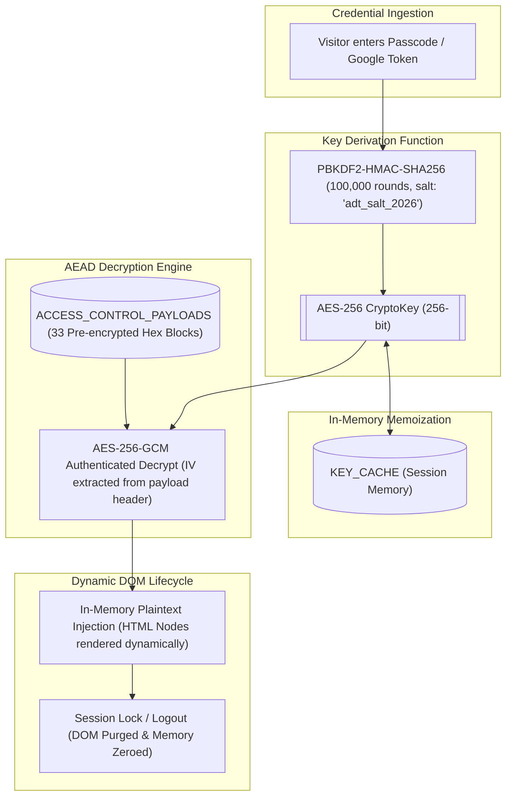

# Architectural Security Audit & Threat Model Assessment: VIP Tier & Web Crypto

**Document ID:** SEC-AUDIT-2026-VIP
**Scope:** Client-Side Access Control, Web Crypto API Implementation, Anti-Scraping Defenses
**Target:** `AaradhyaDT.github.io`
**Classification:** Public Engineering Review & Threat Model Analysis

---

## 1. Executive Summary

An architectural security audit was conducted on the client-side encryption and access-control mechanisms of the `AaradhyaDT.github.io` portfolio website. The site features an interactive multi-tier access-control system powered by the browser-native **Web Crypto API (PBKDF2-HMAC-SHA256 with 100,000 iterations and AES-256-GCM)** alongside **Google Identity Services (OAuth 2.0)**.

The audit evaluates the cryptographic primitives, key derivation lifecycle, and threat model against both casual automated scraping and determined manual inspection.

### Key Findings:
1. **Cryptographic Primitives**: The underlying algorithms (AES-256-GCM authenticated encryption, PBKDF2-HMAC-SHA256 key stretching with 100,000 rounds) are implemented in strict compliance with NIST SP 800-38D and PKCS#5 (RFC 8018) standards.
2. **Threat Model & Intended Architecture**: As a **100% static, zero-backend GitHub Pages application**, Tier 1 (VIP) serves two specific engineering functions:
   - **Static Scraper / Crawler Barrier**: Gated project specs and repository links are stored exclusively as pre-encrypted hex ciphertexts (`ACCESS_CONTROL_PAYLOADS`), preventing unscripted crawlers, simple HTTP bots (`curl`, `requests`), and search engine indexers from harvesting raw URLs without executing the full client runtime.
   - **Interactive Web Crypto Sandbox**: The Tier 1 passcode (`vip2026`) is provided in the UI as a sandbox credential, allowing recruiters, visitors, and engineers to test client-side PBKDF2/AES-GCM decryption in real time.
3. **True Confidentiality Separation**: Genuine administrative authorization is partitioned strictly to **Tier 2 (Master Admin)**, which relies on cryptographically signed Google OAuth 2.0 Identity Tokens (JWT) verified against `aaradhyadevtmr@gmail.com`, with manual passcode authentication disabled.

---

## 2. Cryptographic Implementation & Key Lifecycle

### Technical Specs
- **Cipher**: AES-GCM with 256-bit key length and 128-bit authentication tag.
- **KDF**: PBKDF2 with SHA-256 digest and 100,000 iterations.
- **Memory Management**: Derived `CryptoKey` instances are memoized in an in-memory `Map` (`KEY_CACHE`) during an active session and garbage-collected upon session lock or page reload.
- **DOM Isolation**: Decrypted HTML fragments exist in the DOM only while an elevated session is active; locking the session immediately replaces decrypted nodes with lock placeholders.

---

## 3. Threat Model & Security Boundaries

| Threat Actor / Vector | Risk Level | Defense Status | Architectural Mitigation |
| :--- | :---: | :---: | :--- |
| **Static HTML Scrapers (`curl`, raw `requests`)** | High | **Defeated** | Zero raw HTML leakage; payloads are hex ciphertexts requiring JS execution and key derivation. |
| **Search Engine Crawlers** | High | **Defeated** | Search indexers see only encrypted placeholders; `search-index.js` contains no private URLs or secrets. |
| **Casual Guest Visitors** | Medium | **Controlled** | Repositories and specs display lock badges; UI provides clear tier progression. |
| **JS-Enabled Headless Bots** | Medium | **Friction Only** | Bots executing full JavaScript runtime can read the public sandbox passcode from the DOM and invoke decryption. |
| **Direct Repository Auditors / Git Cloners** | N/A | **By Design** | All client-side code on a public static repository is open-source; the client-side crypto demonstrates browser capabilities rather than an opaque vault. |
| **Master Administrative Access** | Critical | **Enforced** | Master tier cannot be unlocked via passcode; requires valid Google Identity Services OAuth 2.0 token signed by Google for `aaradhyadevtmr@gmail.com`. |

---

## 4. Prioritized Engineering Actions

- [x] **P0 - Documentation & Threat Model Transparency**: Enhanced `README.md` and `access.js` to explicitly state the dual purpose of Tier 1 (Anti-Scraping Friction & Browser Web Crypto Showcase).
- [x] **P0 - Search Index & Command Palette Hygiene**: Verified `assets/js/data/search-index.js` contains zero secrets; scrubbed raw passcode keywords from `assets/js/modules/cmdk.js`.
- [x] **P0 - Payload Integrity Verification**: All 33 encrypted payload blocks verified via `scripts/manage_payloads.py verify`.
- [ ] **P1 - Optional Edge-Worker Gating**: If true zero-knowledge gating is required in future iterations, deploy a serverless edge proxy (e.g. Cloudflare Worker) to handle authorization before delivering encrypted chunks.
